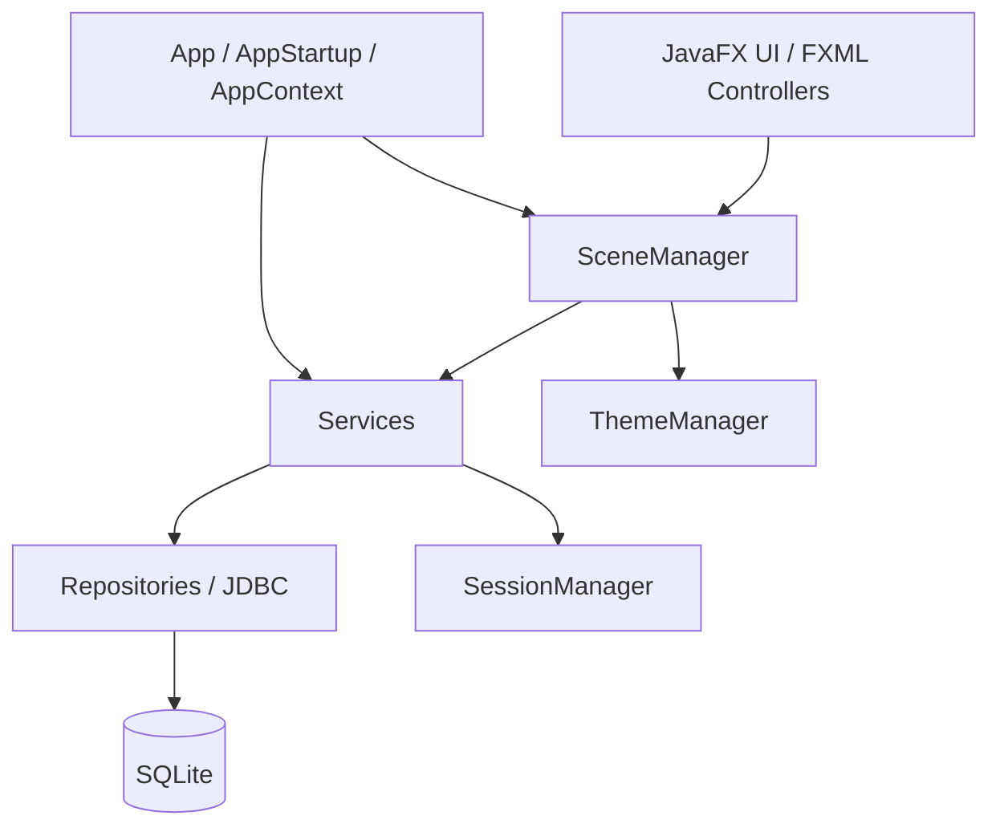

# Java Banking System

Desktop banking application for portfolio and interview demonstration. Java 21 + JavaFX + SQLite with a layered architecture: authentication, checking/savings accounts, deposits, withdrawals, internal transfers, filtered transaction history, and CSV export.

This is a local desktop product—not a production bank, PCI-compliant payment system, or cloud backend.

## Highlights

- Secure registration/login with PBKDF2-HMAC-SHA256 password hashing
- Checking and savings accounts created at registration
- Atomic internal transfers with paired ledger entries
- Transactions workspace: search, filters, date range, pagination, CSV export
- Shared light/dark theme across shell, workspaces, and dialogs
- Stable OS application-data database paths for packaged desktop runs
- Optional explicit demo mode for screenshots and walkthroughs

## Screens / Product Areas

| Area | Status |
|------|--------|
| Login / Register | Complete |
| Dashboard | Complete |
| Accounts | Complete |
| Transactions workspace | Complete |
| Deposit / Withdraw / Transfer dialogs | Complete |
| Light / dark themes | Complete (sidebar toggle and Settings selector) |
| Settings / Profile | Read-only profile and theme selection; preference persistence pending |
| Screenshots | Folder prepared; captures pending manual QA |

## Architecture



Composition root: `AppContext`. Details: [docs/ARCHITECTURE.md](docs/ARCHITECTURE.md).

## Banking Guarantees

- Money uses `BigDecimal` (scale 2); stored as exact TEXT in SQLite—not `double`/`float`
- Transfers update both balances and insert paired ledger rows in one JDBC transaction
- Failed operations roll back completely
- Account and transaction access is ownership-scoped to the authenticated user

## Security

- Passwords hashed with PBKDF2 (600,000 iterations), unique salt per password
- `UserSession` never carries password hashes
- Controllers never contain SQL or mutate balances directly
- Prepared statements for repository SQL
- CSV export masks account numbers and formula-neutralizes risky description prefixes
- Demo mode never bypasses authentication or weakens hashing

## Tech Stack

- Java 21
- JavaFX 21
- Maven
- SQLite (Xerial JDBC)
- JUnit 5
- FXML + CSS

## Run Locally

Requirements: JDK 21+, Maven 3.9+

```bash
mvn clean test
mvn javafx:run
```

Optional database path override:

```bash
mvn javafx:run -Dbank.db.path=/tmp/banking-dev.db
```

Normal launches store data under the OS application-data directory (see below)—not inside a packaged `.app` bundle and not under a fragile process working directory.

## Demo Mode

Demo seeding is **off by default**. Enable only when you want sample data:

```bash
mvn javafx:run -Dbank.demo.seed=true
```

### DEMO-ONLY CREDENTIALS

Public test credentials for walkthroughs/screenshots—not production secrets:

| Field | Value |
|-------|--------|
| Username | `demouser` |
| Password | `DemoPassword12` |

Seeding uses normal `AuthService` / `AccountService` rules. A complete seed is idempotent even after balances return to zero. A partially seeded demo database fails fast with an actionable recreate message (it is not auto-repaired or silently duplicated).

Packaged apps use the same `-Dbank.demo.seed=true` JVM property when you add it to the app’s Java options; normal packaged launches remain demo-free.

## Tests

```bash
mvn clean test
```

80+ automated tests cover banking journeys, ownership, export limits, schema safeguards, path resolution, and demo seeding. Integration tests use JUnit `@TempDir` databases.

## Desktop Packaging

Unsigned local app-image (macOS: `.app`):

```bash
./scripts/package-app.sh
```

Full local verification (tests + package):

```bash
./scripts/verify-release.sh
```

Output: `target/dist/` (for example `BankingSystem.app` on macOS).

Version relationship:

| Value | Source | Purpose |
|-------|--------|---------|
| `1.0-SNAPSHOT` | Maven `project.version` / `AppInfo.VERSION` | Development display version |
| `1.0.0` | Maven `app.packageVersion` / `AppInfo.PACKAGE_VERSION` | Numeric jpackage version |

Signing/notarization are out of scope. `mvn javafx:jlink` is not used (project is intentionally non-modular).

Place final icons in `src/main/resources/icons/` as `app.png` / `app.icns` when ready; packaging succeeds without them.

## Data Location

| Platform | Location |
|----------|----------|
| macOS | `~/Library/Application Support/BankingSystem/banking.db` |
| Windows | `%APPDATA%/BankingSystem/banking.db` |
| Linux | `$XDG_DATA_HOME/BankingSystem/banking.db` or `~/.local/share/BankingSystem/banking.db` |

`%APPDATA%` and `$XDG_DATA_HOME` are used only when they hold an absolute path; otherwise the default location applies.

Legacy `./data/banking.db` from earlier development builds is not moved or deleted automatically.

## Project Structure

```
src/main/java/com/manpreet/bank/
  App.java, AppContext.java, AppStartup.java, ApplicationPaths.java, AppInfo.java
  controller/   # JavaFX controllers
  service/      # Auth, accounts, transactions, export, demo seeder
  repository/   # JDBC repositories
  database/     # SQLite manager + schema initializer
  ui/           # SceneManager, ThemeManager, presentation helpers
src/main/resources/
  fxml/ css/ icons/
scripts/
  package-app.sh
  verify-release.sh
docs/
  ARCHITECTURE.md
  screenshots/
```

## Known Scope / Future Work

- Persist the theme preference across restarts
- Profile editing and password change (requires new service APIs)
- Final visual QA screenshots under `docs/screenshots/`
- Final application icon assets
- External transfers / beneficiaries (future)

Not in scope: cards, loans, bill pay, investments, crypto, cloud backends, Spring/Hibernate microservices.
